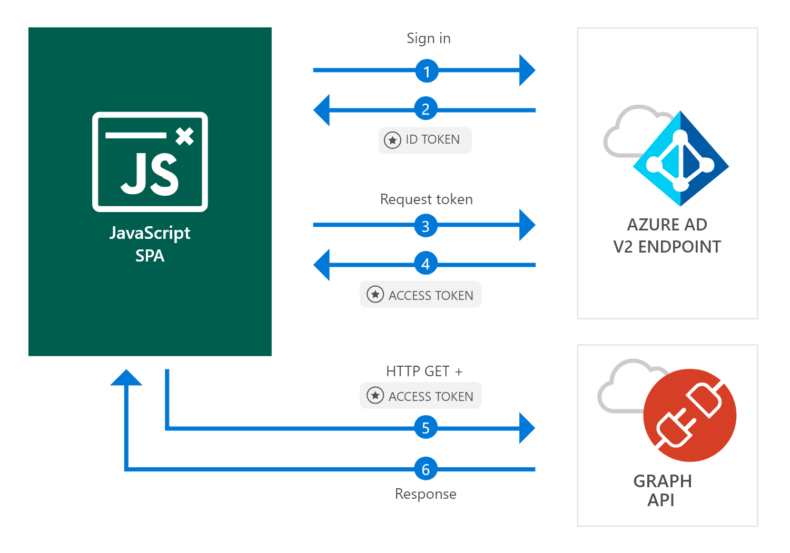

# Sign-in users and acquire an access token from a JavaScript application

This quickstart contains a code sample that demonstrates how a JavaScript Single Page Application (SPA) can sign in personal, work and school accounts, get an access token, and call the Microsoft Graph API.



> [!div renderon="docs"]
> ## Register your application and download your Quickstart app
> You have two options to start your Quickstart application:
> ### Option 1: Register your application and download your Quickstart app [Express]
>
> 1. Go to the [Azure Portal - Application Registration [Prod]](https://portal.azure.com/signin/index/?Microsoft_AAD_RegisteredApps=true#blade/Microsoft_AAD_RegisteredApps/applicationsListBlade/quickStartType/JavascriptSpaQuickstartPage/sourceType/docs)
> 1. Enter a name for your application and click **Register**
> 1. Follow the instructions to download and configure your new application, adding **http<span/>://localhost:30662/** as Redirect URL and setting the **Implict Flow** automatically for you.
> [!div renderon="docs"]
> ### Option 2: Register your application and configure sample [Manual]
> #### Step 1: Register your application
> 
> 1. To register an application, go to the [Azure Portal - Application Registration [Prod]](https://aka.ms/registeredappsprod) and select **New registration**
> 1. Enter a name for your application, add **http<span/>://localhost:30662/** in Reply URL, and click **Register**
> 1. Select **Authentication** menu and set **ID tokens** under *Implict Grant* and select 'Save'

> [!div class="sxs-lookup" renderon="portal"]
> ### Step 1: Configure your application in Azure Portal
> For the code sample for this quickstart to work, you need to add a reply URL as **http<span/>://localhost:30662/** and enable **Implict Grant**.
> > [!div renderon="portal" id="makechanges" class="nextstepaction"]
> > [Make these changes for me]()
>
> > [!div id="appconfigured" class="hidden"]
> >  Your application is configured with these attributes

> [!NOTE]
> If you use Visual Studio, the Redirect URL will be set to to *http:<span/>//localhost:30662/* as it is configured in the code sample's project. If you use Python or any other web server, set redirect URL to *http://<span/>localhost:30662/*, run the following command line:
>> ```bash
>> python -m http.server 30662
>> ```

### Step 2: Download your web server or project

- [Download the Visual Studio project](https://github.com/Azure-Samples/active-directory-javascript-graphapi-v2/archive/VisualStudio.zip)
- [Download the core project files - for a local web server, such as Python](https://github.com/Azure-Samples/active-directory-javascript-graphapi-v2/archive/core.zip)

### Step 3: Configure your JavaScript SPA

> [!div renderon="docs"]
> Edit `msalconfig.js` and replace `Enter_the_Application_Id_here` with the Application ID your application:

> [!div class="sxs-lookup" renderon="portal"]
> Edit `msalconfig.js` and replace msalconfig with:

```javascript
var msalconfig = {
    clientID: "Enter_the_Application_Id_here",
    redirectUri: location.origin
};
```

## More Information

### *msal.js*

MSAL is the library used to sign in users and request tokens used to access an API protected by Microsoft Azure Active Directory. The Quickstart's *index.html* contains reference to the library:

```html
<script src="https://secure.aadcdn.microsoftonline-p.com/lib/0.1.1/js/msal.min.js"></script>
````

### MSAL initialization

The quickstart code also shows how you how you initialize the library:

```javascript
var userAgentApplication = new Msal.UserAgentApplication(msalconfig.clientID, null, loginCallback, {
    redirectUri: msalconfig.redirectUri
});
```

> |Where  |  |
> |---------|---------|
> |ClientId     |Application Id from the application registered in the Azure Portal|
> |loginCallBack | Name of a callback method called after the authentication|
> |redirectUri     |URL where users are sent after authentication against Azure AD v2 Endpoint|

### Sign-in users

Below how you sign in users:

```javascript
userAgentApplication.loginRedirect(graphAPIScopes);
```

> |Where  |  |
> |---------|---------|
> |graphAPIScopes     | (Optional) Contains scopes being requested at login time (i.e. `{ "user.read" }` for Microsoft Graph or `{ "api://<Application ID>/access_as_user" }` for custom Web APIs)|

> [!TIP]
> Alternativelly you may want to use `loginPopup` method to display a popup window for sign-in the user.

### Requesting tokens

Msal has two methods to used acquire tokens `acquireTokenRedirect` (or `acquireTokenPopup`) and `acquireTokenSilent`:

#### Getting a user token silently

The `acquireTokenSilent` method handles token acquisitions and renewal without any user interaction. After `loginRedirect` (or `loginPopup`) is executed for the first time, `acquireTokenSilent` is the method commonly used to obtain tokens used to access protected resources for subsequent calls - as calls to request or renew tokens are made silently.

```javascript
// Try to acquire the token used to query Graph API silently first:
userAgentApplication.acquireTokenSilent(graphAPIScopes)
```

> |Where  |  |
> |---------|---------|
> |graphAPIScopes     | (Optional) Contains scopes being requested at login time (i.e. `{ "user.read" }` for Microsoft Graph or `{ "api://<Application ID>/access_as_user" }` for custom Web APIs)|

#### Getting a user token interactively

 There are situations however that you need to force users interact with Azure Active Directory v2 endpoint – some examples include:
- Users may need to reenter their credentials because the password has expired
- Your application is requesting access to a resource that the user needs to consent to
- Two factor authentication is required

Calling the *acquireTokenRedirect(scope)* result in redirecting users to the Azure Active Directory v2 endpoint (or *acquireTokenPopup(scope)* result on a popup window) where users need to interact with by either confirming their credentials, giving the consent to the required resource, or completing the two factor authentication.

```javascript
userAgentApplication.acquireTokenRedirect(graphAPIScopes);
```

## What is next

Try out the JavaScript tutorial for a complete step-by-step guide on how to build the application for this Quickstart:

### Learn the steps to create the application for this Quickstart

> [!div class="nextstepaction"]
> [Call Graph API tutorial](https://docs.microsoft.com/azure/active-directory/develop/guidedsetups/active-directory-javascriptspa)

<!--
### Learn other scenarios
> [!div class="nextstepaction"]
> [Sign-Out tutorial](..\tutorials\active-directory-javascriptspa-sign-out.md)
> [Call Graph API tutorial](..\tutorials\active-directory-javascriptspa-call-graph-api.md)
-->

[!INCLUDE [Help and support](../../../../includes/active-directory-develop-help-support-include.md)]
