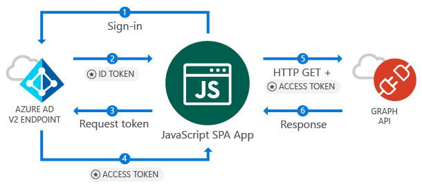

## About this tutorial

This tutorial demonstrates how a JavaScript Single Page Application (SPA) can sign in personal, work and school accounts, request a token to use for querying Microsoft Graph, then call Microsoft Graph to bring user's profile information.

## Before you start

Before you start with this tutorial, you should have an understanding of the following tutorials:

> [!div class="checklist"]
> * [Intro & Setup](active-directory-javascriptspa-intro.md) 
> * [Register an app](active-directory-javascriptspa-register-app.md) 
> * [Sign-In](active-directory-javascriptspa-register-app.md) 

The tutorials above generate a project containing source code and configuration. You can skip these steps above if you prefer to download the code sample generated by these previous tutorials:

## Download

If you prefer to download the project for this tutorial, you have complete two steps:

### First step: Download the code sample

<table>
<tr>
<td>
<h4>Option 1: Download the pre-requisites</h4>
Download the pre-requisites for this tutorial, then complete the steps for this tutorials to finish it:
<ul>
<li>
[Visual Studion 2017 project: Sign-In](https://github.com/Azure-Samples/active-directory-javascript-graphapi-v2/archive/VisualStudio.zip)   - or - 
</li><li>
[Python: Sign-In](https://github.com/Azure-Samples/active-directory-javascript-graphapi-v2/archive/core.zip)
</li>
</ul>
</td>
<td>
<h4>Option 2: Download the complete sample</h4>
Download the complete sample, which includes the code for this tutorial:

<ul>
<li>
[Visual Studion 2017 project: Call Graph API](https://github.com/Azure-Samples/active-directory-javascript-graphapi-v2/archive/VisualStudio.zip)   - or - 
</li><li>
[Python: Call Graph API](https://github.com/Azure-Samples/active-directory-javascript-graphapi-v2/archive/core.zip)
</li>
</ul>
</td>
</table>

### Second Step: Register an application and Configure the sample

Register an application and configure the code sample:

* [Register an app/ Configure sample code](active-directory-javascriptspa-register-app.md) 

## Use the Microsoft Authentication Library (MSAL) to acquire a token to call the Microsoft Graph API

Add the following code to your `app.js` file:

[!code-javascript[main](../../../../active-directory-javascript-graphapi-v2/JavaScriptSPA/app.js?name=callmsgraph&highlight=24,36 "app.js")]

<!--start-collapse-->
### More Information

After a user clicks the *‘Call Microsoft Graph API’* button for the first time, `callGraphApi` method calls `loginRedirect` to sign in the user. This method results in redirecting the user to the *Microsoft Azure Active Directory v2 endpoint* to prompt and validate the user's credentials. As a result of a successful sign-in, the user is redirected back to the original *index.html* page, and a token is received, processed by `msal.js` and the information contained in the token is cached. This token is known as the *ID token* and contains basic information about the user, such as the user display name. If you plan to use any data provided by this token for any purposes, you need to make sure this token is validated by your backend server to guarantee that the token was issued to a valid user for your application.

The SPA generated by this guide does not make use directly of the ID token – instead, it calls `acquireTokenSilent` and/or `acquireTokenRedirect` to acquire an *access token* used to query the Microsoft Graph API. If you need a sample that validates the ID token, take a look at [this](https://github.com/Azure-Samples/active-directory-javascript-singlepageapp-dotnet-webapi-v2 "Github active-directory-javascript-singlepageapp-dotnet-webapi-v2 sample") sample application in GitHub – the sample uses an ASP.NET Web API for token validation.

#### Getting a user token interactively

After the initial sign-in, you do not want the ask users to reauthenticate every time they need to request a token to access a resource – so *acquireTokenSilent* should be used most of the time to acquire tokens. There are situations however that you need to force users interact with Azure Active Directory v2 endpoint – some examples include:
-	Users may need to reenter their credentials because the password has expired
-	Your application is requesting access to a resource that the user needs to consent to
-	Two factor authentication is required

Calling the *acquireTokenRedirect(scope)* result in redirecting users to the Azure Active Directory v2 endpoint (or *acquireTokenPopup(scope)* result on a popup window) where users need to interact with by either confirming their credentials, giving the consent to the required resource, or completing the two factor authentication.

#### Getting a user token silently
The ` acquireTokenSilent` method handles token acquisitions and renewal without any user interaction. After `loginRedirect` (or `loginPopup`) is executed for the first time, `acquireTokenSilent` is the method commonly used to obtain tokens used to access protected resources for subsequent calls - as calls to request or renew tokens are made silently.
`acquireTokenSilent` may fail in some cases – for example, the user's password has expired. Your application can handle this exception in two ways:

1.  Make a call to `acquireTokenRedirect` immediately, which results in prompting the user to sign in. This pattern is commonly used in online applications where there is no unauthenticated content in the application available to the user. The sample generated by this guided setup uses this pattern.

2. Applications can also make a visual indication to the user that an interactive sign-in is required, so the user can select the right time to sign in, or the application can retry `acquireTokenSilent` at a later time. This is commonly used when the user can use other functionality of the application without being disrupted - for example, there is unauthenticated content available in the application. In this case, the user can decide when they want to sign in to access the protected resource, or to refresh the outdated information.

<!--end-collapse-->
